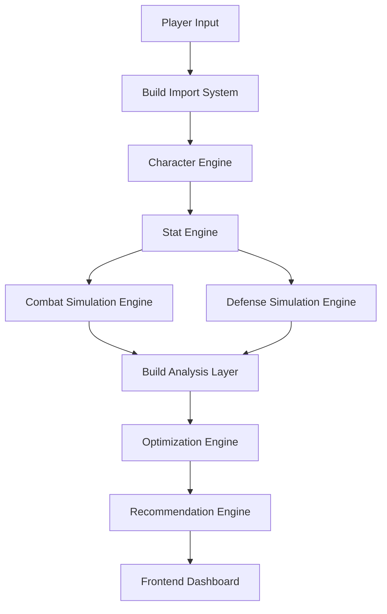

# The Forge

The Forge is a data-driven analysis and optimization toolkit for the action RPG **Last Epoch**.

It helps players evaluate builds, analyze gear, and make better crafting decisions through simulation and statistical modeling.

The goal of The Forge is simple:

Turn complex game systems into clear, actionable insights for players.

---

# Why The Forge Exists

Last Epoch has deep systems:

* layered defensive mechanics
* complex crafting outcomes
* numerous stat interactions
* non-obvious upgrade paths

Players often struggle to answer questions such as:

* Is this item actually an upgrade?
* Which stat improves my damage the most?
* What is the safest way to craft this item?
* Where is my build weakest?

The Forge aims to solve these problems using simulation and analysis.

---

# Key Features

## Build Analysis Engine

Simulates character performance and evaluates build efficiency.

Metrics include:

* DPS estimation
* effective health pool
* damage scaling analysis
* defensive layer evaluation

---

## Crafting Outcome Predictor

Simulates crafting attempts and estimates expected outcomes.

Features include:

* crafting success probabilities
* fracture risk analysis
* expected stat outcomes
* optimal crafting strategies

---

## Stat Optimization Engine

Determines which stats provide the greatest performance improvements.

Example outputs:

* most valuable offensive upgrades
* defensive weaknesses
* stat scaling efficiency

---

## Gear Upgrade Analysis

Compares potential items against the current build to determine:

* real DPS improvement
* survivability impact
* overall efficiency gain

---

# System Architecture

The Forge is built around a central **Intelligence Engine** that powers all analysis systems.

For a full architecture breakdown, see:

docs/system_architecture.md

### High-Level Flow



This pipeline converts raw build data into optimized recommendations.

---

# Documentation

Detailed technical documentation can be found in the docs folder.

## Core Documentation

* docs/system_architecture.md
* docs/intelligence_engine.md
* docs/data_models.md
* docs/engine_architecture.md
* docs/simulation_design.md

These documents explain the internal systems that power The Forge.

---

# Project Structure

Example structure of the repository:

```
the-forge/
│
├ README.md
├ ROADMAP.md
│
├ docs/
│   ├ system_architecture.md
│   ├ intelligence_engine.md
│   ├ data_models.md
│   └ engine_architecture.md
│
├ backend/
│
└ frontend/
```

---

# Development Goals

The Forge is currently being developed as a **local analytics tool** designed for theorycrafters and build optimizers.

The long-term goal is to create a platform that enables players to:

* analyze builds
* simulate crafting outcomes
* identify build weaknesses
* optimize gear progression

---

## Development Guide

See the full next-steps roadmap:

docs/forge_next_steps.md

---

# Long-Term Vision

The Forge aims to become a comprehensive analytical toolkit for Last Epoch players.

Future capabilities may include:

* automated build evaluation
* meta build analytics
* advanced crafting simulators
* encounter-specific optimization

---

# Contributing

This project is currently in early development.

Contributions, feedback, and ideas from the community are welcome.

---

# License

This project is intended for educational and community use.

License details will be added as development progresses.
