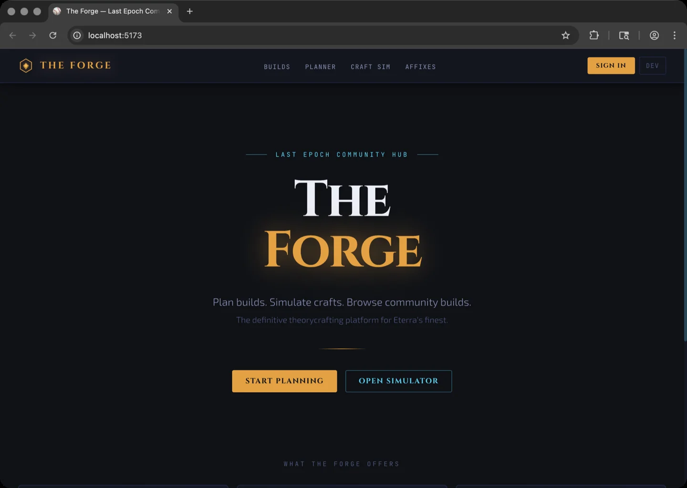
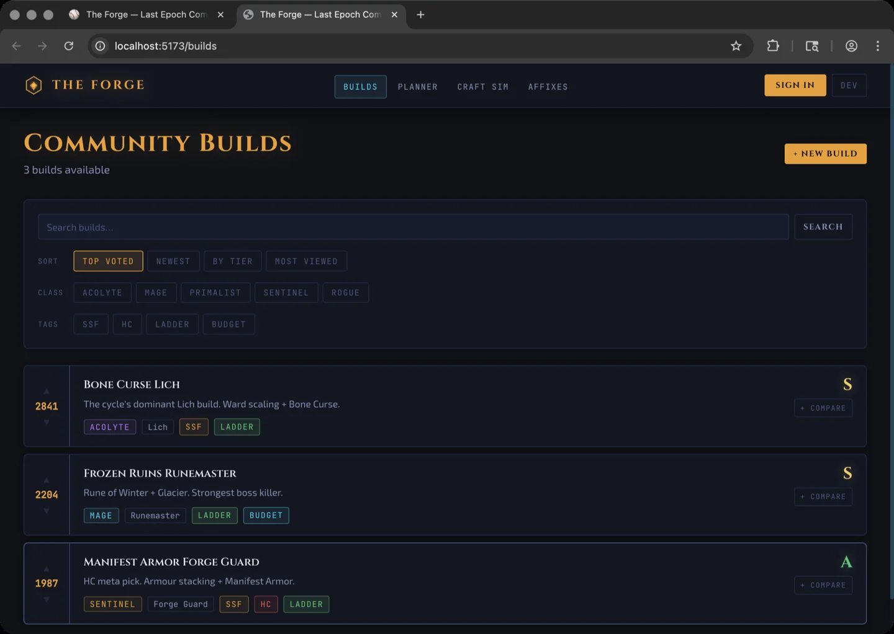
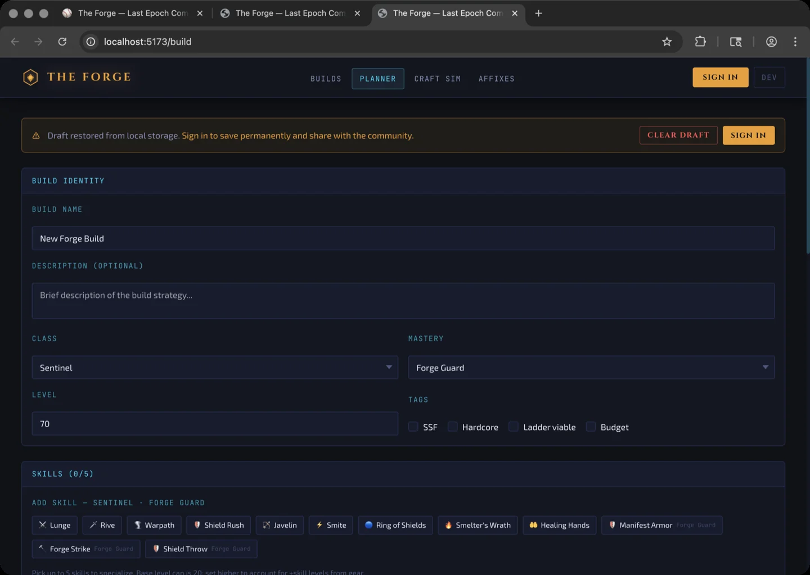
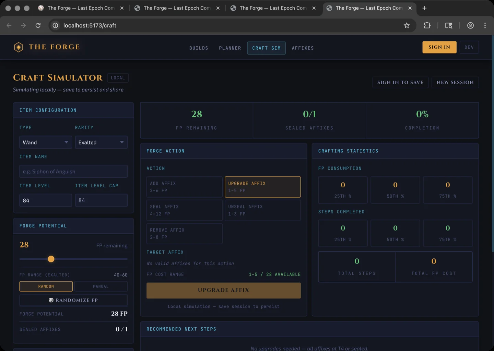
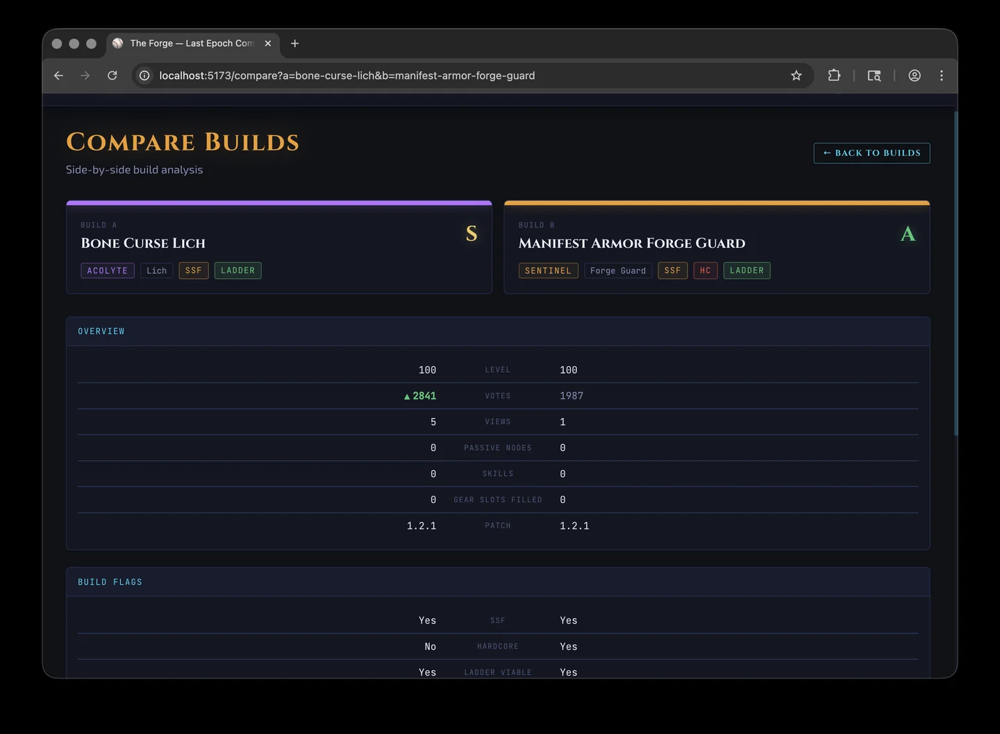
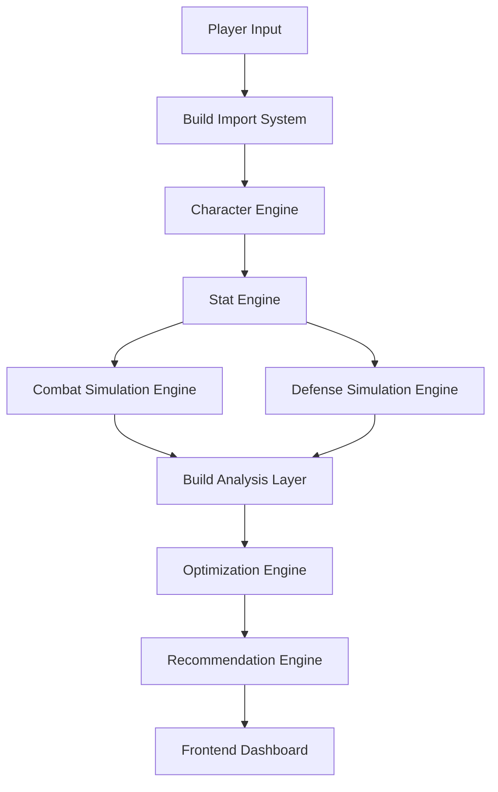

# The Forge

The Forge is a data-driven analysis and optimization toolkit for the action RPG **Last Epoch**.

It helps players evaluate builds, analyze gear, and make better crafting decisions through simulation and statistical modeling.

The goal of The Forge is simple:

Turn complex game systems into clear, actionable insights for players.

---

## Screenshots

| Home | Community Builds |
|------|-----------------|
|  |  |

| Build Planner | Craft Simulator |
|--------------|-----------------|
|  |  |

| Build Comparison |
|-----------------|
|  |

---

# Why The Forge Exists

Last Epoch has deep systems:

* layered defensive mechanics
* complex crafting outcomes
* numerous stat interactions
* non-obvious upgrade paths

Players often struggle to answer questions such as:

* Is this item actually an upgrade?
* Which stat improves my damage the most?
* What is the safest way to craft this item?
* Where is my build weakest?

The Forge aims to solve these problems using simulation and analysis.

---

# Key Features

## Build Analysis Engine

Simulates character performance and evaluates build efficiency.

Metrics include:

* DPS estimation
* effective health pool
* damage scaling analysis
* defensive layer evaluation

**Example output — Bone Curse Lich (Acolyte), level 90:**

```json
{
  "primary_skill": "Bone Curse",
  "skill_level": 20,
  "dps": {
    "hit_damage": 4821,
    "average_hit": 6340,
    "dps": 9732,
    "effective_attack_speed": 1.54,
    "crit_contribution_pct": 31,
    "total_dps": 11480
  },
  "monte_carlo": {
    "mean_dps": 9718,
    "min_dps": 6230,
    "max_dps": 16447,
    "std_dev": 2841.3,
    "percentile_25": 6230,
    "percentile_75": 16447,
    "n_simulations": 10000
  },
  "defense": {
    "max_health": 1840,
    "effective_hp": 6120,
    "armor_reduction_pct": 28,
    "avg_resistance": 62,
    "survivability_score": 71,
    "weaknesses": ["low physical resistance", "no leech"],
    "strengths": ["capped fire resistance", "large ward buffer"]
  },
  "stat_upgrades": [
    { "stat": "necrotic_damage_pct", "label": "+15% Necrotic Damage", "dps_gain_pct": 8.4, "ehp_gain_pct": 0.0 },
    { "stat": "crit_multiplier_pct", "label": "+30% Crit Multiplier",  "dps_gain_pct": 6.1, "ehp_gain_pct": 0.0 },
    { "stat": "max_health",          "label": "+200 Health",           "dps_gain_pct": 0.0, "ehp_gain_pct": 4.9 }
  ]
}
```

---

## Crafting Outcome Predictor

Simulates crafting attempts and estimates expected outcomes.

Features include:

* crafting success probabilities
* expected stat outcomes
* optimal crafting strategies
* Monte Carlo simulation across thousands of attempts

**Example output — Rare Helmet, 28 FP, two T2 prefixes:**

```json
{
  "optimal_path": [
    { "action": "upgrade_affix", "affix": "% increased Health", "from_tier": 2, "to_tier": 4, "fp_cost": 4 },
    { "action": "upgrade_affix", "affix": "% increased Armour",  "from_tier": 2, "to_tier": 4, "fp_cost": 4 },
    { "action": "seal_affix",    "affix": "% increased Health",  "fp_cost": 8 }
  ],
  "simulation_result": {
    "completion_chance": 0.8120,
    "step_survival_curve": [1.0, 0.9430, 0.8120],
    "n_simulations": 10000
  },
  "strategy_comparison": [
    { "name": "Direct Upgrade",  "completion_chance": 0.8120, "fp_efficiency": "high" },
    { "name": "Seal First",      "completion_chance": 0.6340, "fp_efficiency": "medium" }
  ]
}
```

---

## Stat Optimization Engine

Determines which stats provide the greatest performance improvements.

**Example output — Marksman Rogue, Detonating Arrow:**

```json
[
  { "stat": "bow_damage_pct",        "label": "+20% Bow Damage",        "dps_gain_pct": 11.2, "ehp_gain_pct": 0.0 },
  { "stat": "physical_damage_pct",   "label": "+20% Physical Damage",   "dps_gain_pct": 9.8,  "ehp_gain_pct": 0.0 },
  { "stat": "crit_chance_pct",       "label": "+5% Critical Strike",    "dps_gain_pct": 7.3,  "ehp_gain_pct": 0.0 },
  { "stat": "max_health",            "label": "+200 Health",             "dps_gain_pct": 0.0,  "ehp_gain_pct": 6.1 },
  { "stat": "dodge_rating",          "label": "+150 Dodge Rating",       "dps_gain_pct": 0.0,  "ehp_gain_pct": 3.4 }
]
```

---

## Gear Upgrade Analysis

Compares potential items against the current build to determine:

* real DPS improvement
* survivability impact
* overall efficiency gain

---

# System Architecture

The Forge is built around a central **Intelligence Engine** that powers all analysis systems.

For a full architecture breakdown, see:

docs/architecture.md



This pipeline converts raw build data into optimized recommendations.

---

# Documentation

Detailed technical documentation can be found in the docs folder.

## Core Documentation

* docs/architecture.md — system overview, engine structure, and simulation math
* docs/api_reference.md — full REST API reference with request/response schemas
* docs/data_models.md — core data structures
* docs/passive_tree.md — passive tree system design
* docs/development_roadmap.md — master development roadmap and feature plan
* docs/development_phases.md — GitHub workflow phases guide

Screenshots and demo assets are in `docs/screenshots/`. Run `./scripts/screenshot.sh` to capture new screenshots.

---

# Project Structure

Example structure of the repository:

```
the-forge/
│
├ README.md
├ ROADMAP.md
│
├ docs/
│   ├ architecture.md
│   ├ api_reference.md
│   ├ data_models.md
│   ├ passive_tree.md
│   ├ development_roadmap.md
│   └ development_phases.md
│
├ backend/
│
└ frontend/
```

---

# Development Goals

The Forge is currently being developed as a **local analytics tool** designed for theorycrafters and build optimizers.

## Local Desktop Development

Recommended local workflow:

* backend runs locally on your machine
* frontend runs locally on your machine
* PostgreSQL and Redis run via Docker

The default Docker Postgres port is `5433` so local development does not collide
with a host Postgres instance already using `5432`.

Quick start:

```bash
cp .env.example .env
docker compose up -d db redis

cd backend
python -m venv .venv
source .venv/bin/activate
pip install -r requirements.txt
FLASK_APP=wsgi.py FLASK_ENV=development PYTHONPATH=. flask db upgrade
FLASK_APP=wsgi.py FLASK_ENV=development PYTHONPATH=. flask seed
FLASK_APP=wsgi.py FLASK_ENV=development PYTHONPATH=. flask seed-builds
FLASK_APP=wsgi.py FLASK_ENV=development PYTHONPATH=. flask run --port=5050 --debug
```

In a second terminal:

```bash
cd frontend
npm install
npm run dev
```

Or use the root helper scripts after dependencies are installed:

```bash
npm run dev:db
npm run db:upgrade
npm run db:seed
npm run db:seed-builds
npm run dev:backend
npm run dev:frontend
```

Local URLs:

* frontend: `http://localhost:5173`
* backend API: `http://localhost:5050/api`

The long-term goal is to create a platform that enables players to:

* analyze builds
* simulate crafting outcomes
* identify build weaknesses
* optimize gear progression

---

## Development Guide

See the development roadmap:

docs/development_roadmap.md

### Game Data Setup

The backend relies on curated game data in `/data/`. This is pre-generated and committed to the repo — no extra steps needed for most contributors.

If you need to re-sync from the raw game exports (e.g. after a patch), clone the data repo alongside this one and run the sync script:

```bash
# From the project root
git clone https://github.com/NickolisK24/last-epoch-data.git
python scripts/sync_game_data.py
```

> **Note:** `last-epoch-data/` is intentionally excluded from this repo (`.gitignore`) as it contains raw extracted game assets. Only the processed `/data/` output is committed.

---

# Long-Term Vision

The Forge aims to become a comprehensive analytical toolkit for Last Epoch players.

Future capabilities may include:

* automated build evaluation
* meta build analytics
* advanced crafting simulators
* encounter-specific optimization

---

# Contributing

This project is currently in early development.

Contributions, feedback, and ideas from the community are welcome.

---

# License

This project is licensed under the [MIT License](LICENSE).
