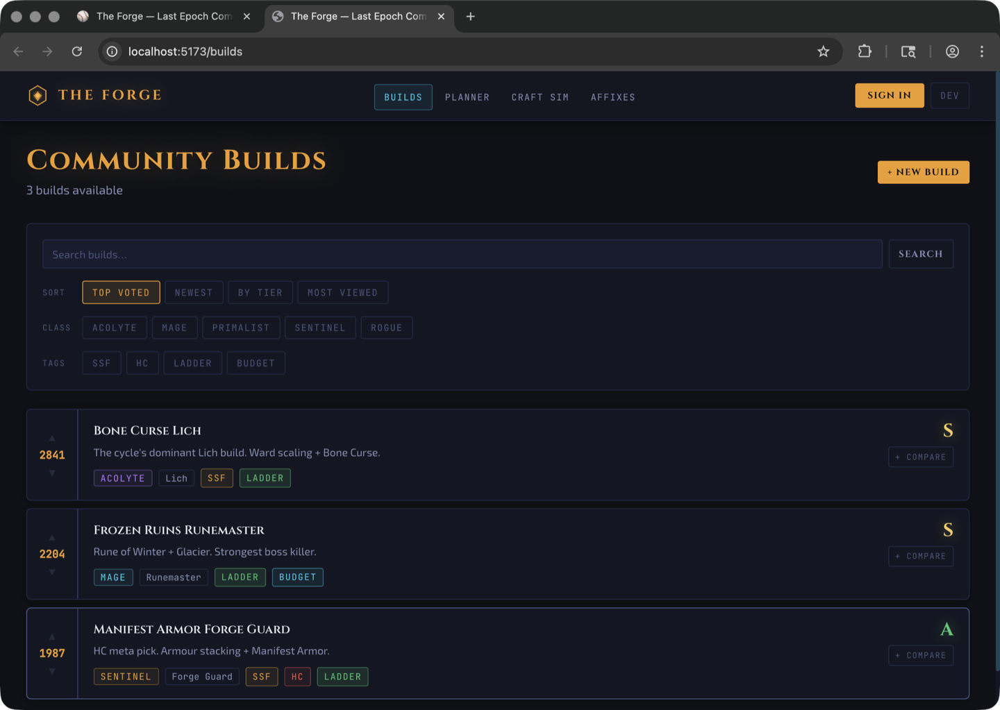
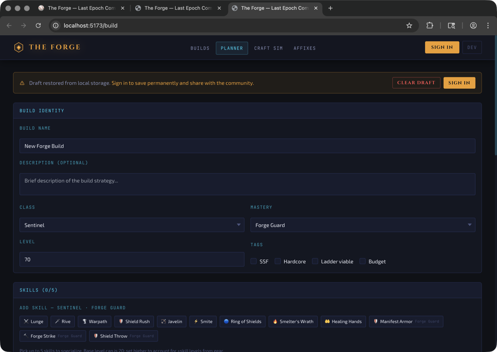
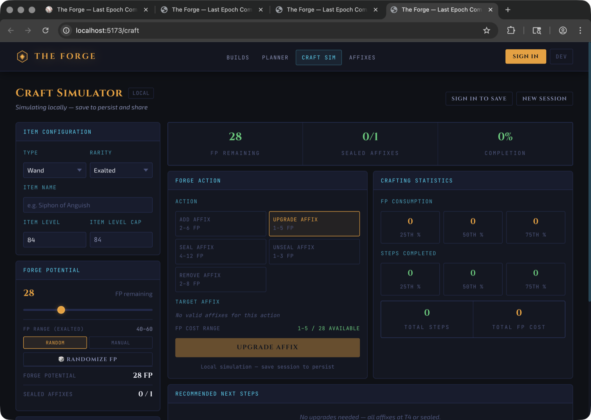
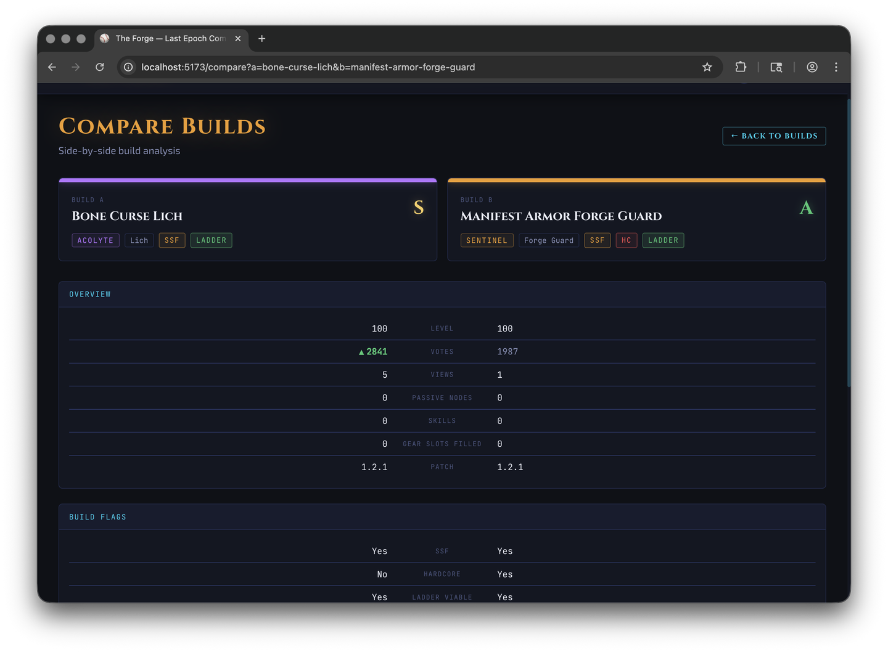

# The Forge

**Build optimization and combat simulation toolkit for Last Epoch.**

The Forge is a full-stack simulation platform that helps Last Epoch players plan character builds, simulate DPS and survivability against specific bosses, optimize gear through crafting probability analysis, import builds from community tools, and compare builds across the meta. It is powered by a deterministic Python engine layer with 10,000+ tests and a React TypeScript frontend.

Built as both a community tool and an engineering portfolio project demonstrating full-stack development, simulation systems, and data-driven game analysis.


---

## Features

### Build Planner
- Create and edit character builds with class and mastery selection (5 classes, 15 masteries)
- Interactive passive tree with real in-game node positions, BFS path validation, and hexagonal node rendering
- Skill tree specialization with node point allocation and spec tree modifiers
- Paper-doll gear editor with item picker, unique item support, and idol slots
- Leveling path tracker -- scrollable timeline recording passive allocation order per level

### Stat Engine (8-Layer Deterministic Pipeline)
1. **Base Stats** -- class and mastery base values
2. **Flat Additions** -- gear implicits and affix flat values
3. **Increased (%)** -- additive percentage pool
4. **More Multipliers** -- multiplicative product pool
5. **Conversions** -- damage type conversions
6. **Derived Stats** -- attribute-to-secondary expansion (Strength to health, Intelligence to ward retention, etc.)
7. **Registry Derived** -- EHP, armor mitigation, dodge chance
8. **Conditional Stats** -- context-dependent bonuses (while moving, against bosses, enemy frozen, etc.)

### Combat Simulation
- Skill execution engine computing per-hit damage, crit-weighted average hit, and DPS
- Enemy defense engine applying per-type resistance, armor mitigation, and penetration
- Ailment DPS (Ignite, Bleed, Poison) computed from proc chance and scaling stats
- Monte Carlo damage variance simulation with configurable sample size and deterministic seeding
- Multi-target encounter simulation with target selection, damage distribution, and spawn lifecycle
- Boss encounter simulation with multi-phase transitions, immunity windows, and enrage timers
- Time-based combat loop with priority-ordered skill rotation and cooldown tracking
- Mana resource gating -- skills require mana to cast, mana regenerates per tick

### Crafting Simulator
- Forging potential cost model with RNG simulation
- Affix tier system with 1,000+ affix definitions synced from game data
- Monte Carlo simulation across thousands of craft attempts
- Strategy comparison (aggressive, balanced, conservative) and optimal path search
- Probability visualization with timeline and outcome charts
- Undo/redo support and per-step audit trail

### Optimization Engine
- Stat sensitivity analysis testing 50+ stats with weighted impact scoring
- Upgrade efficiency scoring factoring DPS gain, EHP gain, and FP cost
- Offensive/defensive ranking with configurable weighting modes (balanced, offense, defense)
- Pareto-optimal candidate detection for multi-objective optimization
- Per-slot gear upgrade ranking with cross-slot top-10 recommendations

### Advanced Analysis
- Boss encounter simulation with per-phase DPS, time-to-kill, and survival scoring
- Corruption scaling curve analysis with recommended max corruption threshold
- Gear upgrade ranking evaluating candidate items against current build
- Best-in-slot search engine with weighted affix targeting

### Build Import
- Import from Last Epoch Tools and Maxroll URLs
- Partial import with gap reporting for incomplete builds
- Admin failure tracking dashboard with severity classification
- Discord webhook alerts for import failures

### Community Tools
- Community builds browser with filtering, voting, pagination, and tier ranking
- Build comparison engine with full DPS/EHP simulation results and weighted overall winner
- Meta analytics with class/mastery distribution, popular skills and affixes, trending builds by view velocity
- View tracking with privacy-safe SHA-256 hashed IPs (raw IPs never stored)
- Shared build reports with OpenGraph meta tags for Discord link previews

### Authentication and Profiles
- Discord OAuth2 login with JWT session management
- User profiles with build history and craft session history
- Admin role with affix management and import failure monitoring

---

## Tech Stack

| Layer | Technology |
|-------|------------|
| Frontend | React 18, TypeScript 5.4, Vite 5, Tailwind CSS 3 |
| State Management | Zustand 4, TanStack Query 5 |
| Charts | Recharts 3 |
| Backend | Python 3.11, Flask 3.0 |
| Database | PostgreSQL 15 |
| Cache / Rate Limiting | Redis 7, Flask-Limiter |
| ORM | SQLAlchemy + Flask-Migrate (Alembic) |
| Auth | Flask-Dance (Discord OAuth2), Flask-JWT-Extended |
| Validation | Marshmallow 3 |
| Testing | pytest (10,000+ tests), Vitest |
| Desktop | Electron 41 (optional) |
| Deployment | Docker Compose |

---

## Project Structure

```
le-the-forge/
├── backend/
│   ├── app/
│   │   ├── engines/            22 pure calculation modules (stat, combat, defense, craft, optimization, etc.)
│   │   ├── services/           11 orchestration services (build analysis, craft, simulation, etc.)
│   │   ├── routes/             24 Flask blueprints (builds, simulate, craft, compare, meta, etc.)
│   │   ├── schemas/            Marshmallow request/response validation
│   │   ├── models/             SQLAlchemy ORM models (User, Build, CraftSession, PassiveNode, etc.)
│   │   ├── game_data/          Data pipeline loader and registries
│   │   └── utils/              Auth, cache, responses, CLI commands, logging
│   ├── migrations/             Alembic migration versions
│   └── tests/                  10,000+ tests across 251 test files
├── frontend/
│   └── src/
│       ├── components/         Feature components organized by domain
│       │   ├── features/       Build planner, craft simulator, encounter, optimizer, etc.
│       │   └── ui/             Shared UI components (Panel, Button, Badge, Modal, Skeleton, etc.)
│       ├── pages/              Route-level page components
│       ├── lib/                API client with typed request/response
│       ├── hooks/              TanStack Query hooks and utilities
│       ├── store/              Zustand state stores (auth, craft)
│       └── types/              TypeScript type definitions
├── data/                       Canonical game data (JSON)
│   ├── classes/                Class definitions, passives, skill trees, skill metadata
│   ├── combat/                 Damage types, ailments, monster modifiers
│   ├── entities/               Enemy and boss profiles
│   ├── items/                  Affixes, base items, uniques, crafting rules, rarities
│   ├── localization/           Game string tables
│   ├── progression/            Blessings
│   └── world/                  Zones, timelines, dungeons, quests, loot tables
├── docs/                       Documentation and screenshots
├── electron/                   Desktop app wrapper (main process + preload)
├── scripts/                    Game data sync, icon extraction, tree data generation
├── docker-compose.yml
├── ARCHITECTURE.md
├── CONTRIBUTING.md
├── CHANGELOG.md
├── ROADMAP.md
└── LICENSE                     MIT
```

---

## Local Development Setup

### Prerequisites

- Docker Desktop (for PostgreSQL + Redis)
- Python 3.11+
- Node.js 20+

### Quick Start

```bash
# Clone and configure
git clone https://github.com/NickolisK24/le-the-forge.git
cd le-the-forge
cp .env.example .env

# Start database and cache
docker compose up -d db redis

# Backend setup
cd backend
python -m venv .venv
source .venv/bin/activate
pip install -r requirements.txt
FLASK_APP=wsgi.py FLASK_ENV=development PYTHONPATH=. flask db upgrade
FLASK_APP=wsgi.py FLASK_ENV=development PYTHONPATH=. flask seed
FLASK_APP=wsgi.py FLASK_ENV=development PYTHONPATH=. flask seed-passives
FLASK_APP=wsgi.py FLASK_ENV=development PYTHONPATH=. flask run --port=5050 --debug
```

In a second terminal:

```bash
# Frontend
cd frontend
npm install
npm run dev
```

- Frontend: http://localhost:5173
- Backend API: http://localhost:5050/api

### Running Tests

```bash
cd backend
source .venv/bin/activate
PYTHONPATH=. pytest tests/ -x -q
```

### Data Validation

```bash
cd backend
source .venv/bin/activate
FLASK_APP=wsgi.py PYTHONPATH=. flask validate-data
```

### Alternative: Full Docker

```bash
docker compose up --build

# First run only -- seed the database
docker compose exec -e PYTHONPATH=/app backend flask db upgrade
docker compose exec -e PYTHONPATH=/app backend flask seed
docker compose exec -e PYTHONPATH=/app backend flask seed-passives
```

---

## Screenshots

| Page | Screenshot |
|------|-----------|
| Home |  |
| Community Builds |  |
| Build Planner |  |
| Craft Simulator |  |
| Build Comparison |  |

---

## What's Coming

From the [roadmap](ROADMAP.md):

- **Phase 9 -- Deploy & Launch**: CI/CD with GitHub Actions, production deployment, performance audit, mobile responsiveness, community launch

Long-term vision:
- Native desktop packaging via Electron
- Advanced crafting prediction models
- Encounter-specific build optimization
- Patch auto-sync pipeline via GitHub Actions

---

## Contributing

See [CONTRIBUTING.md](CONTRIBUTING.md) for setup instructions, branch conventions, code style guidelines, and PR checklist.

---

## License

[MIT](LICENSE)
