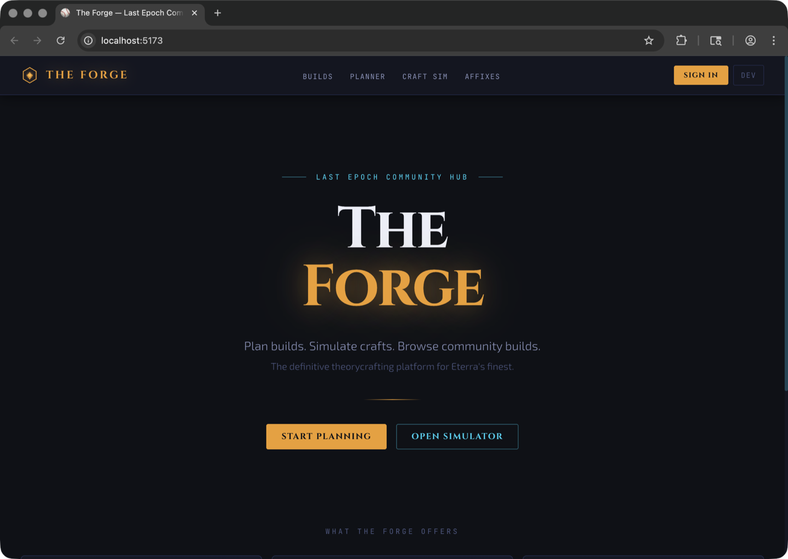

# The Forge

**A deterministic Last Epoch build analysis and simulation platform.**

[](https://github.com/NickolisK24/le-the-forge/actions/workflows/ci.yml)


<p align="center">
  
</p>

---

## What Is The Forge

The Forge is a build analysis platform for Last Epoch. It takes a character build — class, mastery, passive tree, skill specializations, and gear — and runs it through a deterministic simulation engine to produce DPS numbers, survivability scores, crafting probability curves, and upgrade recommendations. If you have ever wondered whether swapping an affix or reallocating a passive node actually makes your build stronger, The Forge gives you a concrete answer.

Unlike build planners that stop at showing stat totals, The Forge simulates the full combat loop: skill execution, crit weighting, Monte Carlo damage variance, boss encounter phases, mana gating, and enemy-specific resistance and armour mitigation. The goal is mechanical accuracy — every number traces back to a formula you can inspect, and the engine runs the same calculation every time for the same inputs.

The project is currently at **v0.8.0**, approaching a v1.0.0-beta community launch. The core simulation pipeline is stable and backed by 10,750+ tests, but some input data — particularly skill base damage values and enemy armour profiles — are benchmarked approximations rather than verified game extracts. These are noted honestly throughout the tool and in the [Known Limitations](#known-limitations-beta) section below. Community validation of these values is actively sought and is one of the most impactful ways to contribute.

---

## Features

### Core Analysis

- **8-layer deterministic stat pipeline** — Base Stats, Flat Additions, Increased (%), More Multipliers, Conversions, Derived Stats, Registry Derived (EHP, armour mitigation, dodge chance), and Conditional bonuses
- **Combat simulation engine** — per-hit damage, crit-weighted DPS, ailment damage over time, and Monte Carlo variance modeling with configurable sample size and deterministic seeding
- **Boss encounter simulation** — multi-phase fights with per-phase DPS, time-to-kill, immunity windows, enrage timers, and survival scoring
- **Corruption scaling analysis** — non-linear health and damage multiplier curves with recommended max corruption threshold
- **Optimization engine** — stat sensitivity analysis across 50+ stats, upgrade efficiency scoring factoring DPS gain, EHP gain, and Forging Potential cost, with Pareto-optimal candidate detection

### Build Tools

- **Build import** from Last Epoch Tools and Maxroll URLs — class, mastery, passives, and skills transfer automatically; gear import is [in active development](#known-limitations-beta)
- **Skill tree UI** with interactive node graph, point allocation, and BFS path validation
- **Passive tree** with real in-game node positions, hexagonal rendering, BFS reachability validation, and leveling path tracker
- **Primary skill auto-detection** with manual override
- **Community builds browser** with filtering, voting, tier ranking, and build comparison with weighted DPS/EHP scoring
- **Meta analytics** — class and mastery distribution, popular skills and affixes, trending builds by view velocity
- **Shared build reports** with OpenGraph meta tags for Discord link previews

### Crafting

- **Crafting simulator** with 1,000+ affix definitions synced from game data
- **Forging Potential cost model** with RNG simulation and strategy comparison (aggressive, balanced, conservative)
- **Monte Carlo probability curves** across thousands of craft attempts with per-step audit trail and undo/redo support

---

## Tech Stack

| Layer | Technology |
|---|---|
| Frontend | React 18, TypeScript 5.4, Vite 5, Tailwind CSS 3 |
| State | Zustand 4, TanStack Query 5 |
| Charts | Recharts 3 |
| Backend | Python 3.11+, Flask 3.0, Marshmallow 3 |
| Database | PostgreSQL 15 |
| Cache | Redis 7, Flask-Limiter |
| ORM | SQLAlchemy + Flask-Migrate (Alembic) |
| Auth | Discord OAuth2 (Flask-Dance), JWT (Flask-JWT-Extended) |
| Testing | pytest (10,750+ tests), TypeScript strict mode, Vitest |
| Desktop | Electron 41 (optional, scaffolded) |
| CI/CD | GitHub Actions (pytest, tsc, ESLint, Docker build) |
| Infrastructure | Docker Compose (local), Gunicorn (production) |

---

## Getting Started (Local Development)

### Prerequisites

- Docker Desktop (for PostgreSQL and Redis)
- Python 3.11+
- Node.js 20+

### Quick Start

```bash
# Clone and configure
git clone https://github.com/NickolisK24/le-the-forge.git
cd le-the-forge
cp .env.example .env
# Edit .env — fill in DISCORD_CLIENT_ID and DISCORD_CLIENT_SECRET
# if you need OAuth login. Everything else has working defaults.

# Start database and cache
docker compose up -d db redis
```

Backend (terminal 1):

```bash
cd backend
python -m venv .venv
source .venv/bin/activate
pip install -r requirements.txt

# Database setup and seed
FLASK_APP=wsgi.py FLASK_ENV=development PYTHONPATH=. flask db upgrade
FLASK_APP=wsgi.py FLASK_ENV=development PYTHONPATH=. flask seed
FLASK_APP=wsgi.py FLASK_ENV=development PYTHONPATH=. flask seed-passives

# Start the dev server
FLASK_APP=wsgi.py FLASK_ENV=development PYTHONPATH=. flask run --port=5050 --debug
```

Frontend (terminal 2):

```bash
cd frontend
npm install
npm run dev
```

- **Frontend:** http://localhost:5173
- **Backend API:** http://localhost:5050/api

### Full Docker (alternative)

```bash
docker compose up --build

# First run only — migrations and seed run automatically via the
# backend entrypoint, but you can also run them manually:
docker compose exec -e PYTHONPATH=/app backend flask db upgrade
docker compose exec -e PYTHONPATH=/app backend flask seed
docker compose exec -e PYTHONPATH=/app backend flask seed-passives
```

### Running Tests

```bash
cd backend
PYTHONPATH=. pytest tests/ -x -q
```

### TypeScript Check

```bash
cd frontend
npx tsc --noEmit
```

### Data Validation

```bash
cd backend
FLASK_APP=wsgi.py PYTHONPATH=. flask validate-data
```

---

## Project Structure

```
le-the-forge/
├── backend/
│   ├── app/
│   │   ├── engines/        22 pure calculation modules (stat, combat, defense, craft, optimization)
│   │   ├── services/       11 orchestration services (build analysis, simulation, craft, meta)
│   │   ├── routes/         25 Flask blueprints (builds, simulate, craft, compare, meta, import)
│   │   ├── schemas/        Marshmallow request/response validation
│   │   ├── models/         SQLAlchemy ORM models (User, Build, CraftSession, PassiveNode)
│   │   ├── game_data/      Data pipeline loader and registries
│   │   └── utils/          Auth, cache, responses, CLI commands
│   ├── builds/             Build definition, stats engine, serializers
│   ├── combat/             Hit resolution, spatial simulation
│   ├── migrations/         Alembic migration versions
│   ├── scripts/            Verification scripts (verify_base_stats.py)
│   └── tests/              10,750+ tests across 250+ test files
├── frontend/
│   └── src/
│       ├── components/     Feature components (build, craft, encounter, optimizer, bis)
│       ├── pages/          Route-level page components
│       ├── lib/            Typed API client
│       ├── hooks/          TanStack Query hooks
│       ├── store/          Zustand state stores
│       └── types/          TypeScript type definitions
├── data/                   Canonical game data (JSON)
│   ├── classes/            Class definitions, passives, skill trees, skill metadata
│   ├── combat/             Damage types, ailments, monster modifiers
│   ├── entities/           Enemy and boss profiles
│   ├── items/              Affixes, base items, uniques, crafting rules, rarities
│   ├── localization/       Game string tables
│   ├── progression/        Blessings
│   └── world/              Zones, timelines, dungeons, quests, loot tables
├── docs/                   Architecture docs, audit reports, screenshots
├── electron/               Desktop app wrapper (Electron main process + preload)
├── scripts/                Game data sync, icon extraction, tree data generation
├── .github/workflows/      GitHub Actions CI pipeline
├── docker-compose.yml
├── ARCHITECTURE.md
├── CONTRIBUTING.md
├── CHANGELOG.md
└── ROADMAP.md
```

---

## Game Data

### Data Sources

The `data/` directory contains canonical game data extracted from Last Epoch and normalized into JSON:

- **`data/classes/`** — class definitions with base stats, passive tree nodes with layout coordinates, skill metadata, and skill specialization trees
- **`data/items/`** — 1,000+ affixes with tier ranges, base items, uniques, crafting rules, implicit stats, and rarity definitions
- **`data/combat/`** — damage types, ailment definitions, monster modifiers
- **`data/entities/`** — enemy and boss profiles with health, armour, and resistance values

### Versioning and Updates

Game data is synced from Last Epoch exports using `scripts/sync_game_data.py`, which normalizes raw data into the `/data/` JSON schema. The current data tracks **patch 1.4.3, Season 4**. After a game patch, re-run the sync script and validate:

```bash
cd backend
FLASK_APP=wsgi.py PYTHONPATH=. flask validate-data
```

This checks all JSON files for valid structure, correct root types, minimum entry counts, and required file presence.

### Data Confidence

Not all values in the game data are verified extracts. The confidence model:

| Data Category | Confidence | Notes |
|---|---|---|
| Class base stats | Verified | Recorded from level-1 character sheets, no gear, no passives |
| Attribute scaling | Verified | Confirmed per-point grants from in-game tooltips |
| Affix definitions and tier ranges | High | Extracted from game files |
| Skill base damage (141 of 175 skills) | High | Extracted from game data |
| Skill base damage (34 skills) | 70-80% | Calibrated estimates; community validation welcome ([#148](https://github.com/NickolisK24/le-the-forge/issues/148)) |
| Enemy armour and resistance profiles | Estimated | Community documentation, not verified against game files ([#162](https://github.com/NickolisK24/le-the-forge/issues/162)) |
| Passive node stat grants | Mixed | Being migrated from estimated cycles to real node data ([#156](https://github.com/NickolisK24/le-the-forge/issues/156)) |

---

## Architecture Overview

The backend is the single source of truth for all calculations. The frontend sends build input, receives simulation results, and renders UI — it never computes stats or DPS locally. The backend follows a three-layer architecture: **Routes** (HTTP interface) delegate to **Services** (orchestration and database access) which call **Engines** (pure calculation modules with no side effects, no database, no HTTP). Game data flows from JSON files through a startup data pipeline into in-memory registries consumed by engines.

For full details — the 24 API blueprints, engine inventory, database schema, Redis cache keys, rate limiting strategy, and frontend component organization — see [ARCHITECTURE.md](ARCHITECTURE.md).

---

## Testing

The test suite currently has **10,750 passing tests** (377 skipped) covering:

- **Stat pipeline** — all 8 layers, attribute scaling, class base stats, derived stat registry
- **Combat simulation** — DPS calculation, crit weighting, Monte Carlo variance, boss encounters, multi-target
- **Defense engine** — EHP, armour mitigation, resistance capping, dodge, ward, survivability scoring
- **Crafting engine** — FP cost model, affix tier upgrades, Monte Carlo craft simulation
- **Optimization** — sensitivity analysis, efficiency scoring, Pareto front, best-in-slot search
- **Import system** — Last Epoch Tools and Maxroll parsing, partial import, failure tracking
- **API endpoints** — request validation, response schemas, error handling, rate limiting
- **Regression suite** — locked known-good stat and simulation outputs to catch formula changes

### Running the Suite

```bash
cd backend
PYTHONPATH=. pytest tests/ -x -q
```

### TypeScript Safety

The frontend enforces TypeScript strict mode with zero errors. This is checked in CI via `tsc --noEmit` and blocks merge on failure. For a simulation platform, type safety in the data layer between backend responses and frontend rendering is treated as non-negotiable — a silently wrong number is worse than a crash.

---

## Contributing

See [CONTRIBUTING.md](CONTRIBUTING.md) for full setup instructions, code style, and the PR checklist.

### Branch Conventions

| Prefix | Purpose |
|---|---|
| `feature/` | New functionality |
| `fix/` | Bug fixes |
| `refactor/` | Structural changes, no behavior change |
| `chore/` | Dependency updates, config |
| `docs/` | Documentation only |

### Workflow

All work branches off `dev`. PRs target `dev`. Never push directly to `main` — it receives squash merges from `dev` for releases.

### Commit Messages

```
<type>: <short description>
```

Types: `feat`, `fix`, `refactor`, `chore`, `docs`, `test`

### Reporting Bugs

Open an issue on [GitHub Issues](https://github.com/NickolisK24/le-the-forge/issues). Include the build configuration and expected vs. actual values when reporting simulation inaccuracies.

### High-Value Contributions Right Now

**DPS validation** — comparing Forge simulation output to real in-game training dummy numbers — is the single most impactful contribution. Even one data point for one skill helps calibrate the engine. See [#148](https://github.com/NickolisK24/le-the-forge/issues/148) for the full list of skills needing validation.

---

## Known Limitations (Beta)

The Forge is approaching its community launch but is honest about what is not yet complete:

- **Gear import from Last Epoch Tools does not include items** — class, mastery, passives, and skills import correctly, but gear requires an item ID mapping that is still being built ([#155](https://github.com/NickolisK24/le-the-forge/issues/155))
- **Maxroll import is unverified** — the importer exists but has not been end-to-end tested against current Maxroll URLs ([#163](https://github.com/NickolisK24/le-the-forge/issues/163))
- **Passive node stats partially mapped to simulation** — all 541 passive nodes now load their real stat payload from the game data file rather than the estimated modulo cycle, and 39.2% of stat entries (79.8% of stat keys that appear on 2+ nodes) resolve into numeric BuildStats fields; the four S4 meta builds (Ballista Falconer, Warpath Void Knight, Profane Veil Warlock, Lightning Blast Runemaster) are validated with zero stat leakage into special_effects for their canonical allocations
- **Remaining 60.8% of passive stat entries are preserved in special_effects** — conditional mechanics ("while Dual Wielding"), proc triggers, and flag-style effects don't feed the numeric simulation yet; continued mapping is ongoing and the modulo cycle is kept only as a last-resort fallback, logged on use, for node IDs with no DB entry ([#156](https://github.com/NickolisK24/le-the-forge/issues/156))
- **34 skill base damage values are approximations** at 70-80% confidence — community validation welcome ([#148](https://github.com/NickolisK24/le-the-forge/issues/148))
- **Enemy armour and resistance profiles are estimates** — not verified against game data ([#162](https://github.com/NickolisK24/le-the-forge/issues/162))
- **Minion DPS is not modeled** — affects Necromancer and Beastmaster builds; minion skills show 0 DPS ([#157](https://github.com/NickolisK24/le-the-forge/issues/157))
- **Ailment DPS (Ignite, Bleed, Poison) is unverified** against live gameplay values ([#159](https://github.com/NickolisK24/le-the-forge/issues/159))
- **Conditional stat bonuses are calculated but not wired into DPS** — bonuses like "while moving" or "against bosses" are computed by Layer 8 but not yet consumed by the combat simulation ([#158](https://github.com/NickolisK24/le-the-forge/issues/158))
- **Craft engine determinism bug** — `simulate_craft_attempt` does not fully thread its RNG seed through all subroutines ([#223](https://github.com/NickolisK24/le-the-forge/issues/223))

---

## Roadmap

The project follows a phased development plan. Phases 1-8 are complete.

**Pre-Launch (blocking v1.0.0-beta):**

1. **Full Gear Import** — complete item ID mapping for Last Epoch Tools and Maxroll ([#155](https://github.com/NickolisK24/le-the-forge/issues/155))
2. **Real Passive Node Data** — migrate all passive nodes from estimated cycles to verified per-node stats ([#156](https://github.com/NickolisK24/le-the-forge/issues/156))
3. **Craft Engine Determinism** — thread the local RNG seed through all craft simulation subroutines to guarantee reproducible results ([#223](https://github.com/NickolisK24/le-the-forge/issues/223))
4. **Phase 9 — Deploy and Launch** — CI/CD pipeline, production deployment, performance audit, mobile responsiveness, community launch

**Post-Launch:**

5. **Phase 10 — Desktop Packaging** — Electron wrapper with bundled backend for offline use
6. **Phase 11 — Conditional DPS Integration** — wire Layer 8 conditional bonuses into the combat simulation path
7. **Phase 12 — Minion Engine** — per-minion-type damage modeling for summoner builds
8. **Phase 13 — Advanced Crafting Models** — probabilistic outcome prediction beyond Monte Carlo
9. **Phase 14 — Encounter-Specific Optimization** — stat recommendations targeting specific boss fights
10. **Phase 15 — Patch Auto-Sync** — GitHub Actions pipeline to automatically update game data when patches release
11. **Phase 16 — AI-Powered Build Q&A** — natural language build analysis and recommendations

See the full [Roadmap](ROADMAP.md) and the [GitHub Issues](https://github.com/NickolisK24/le-the-forge/issues) for current status.

---

## License

[MIT](LICENSE)

---

## Acknowledgements

- **Last Epoch** is developed by [Eleventh Hour Games](https://eleventh-hour-games.com/). The Forge is an independent community project and is not affiliated with or endorsed by EHG.
- Game data is sourced from community exports and public documentation. Thank you to the Last Epoch datamining and theorycrafting community.
- Community data contributions — especially DPS validation against live gameplay — are what make this tool accurate. Every data point helps.
