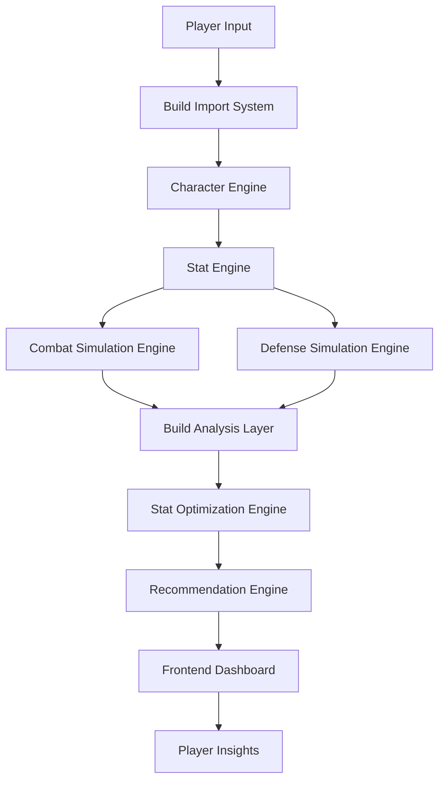
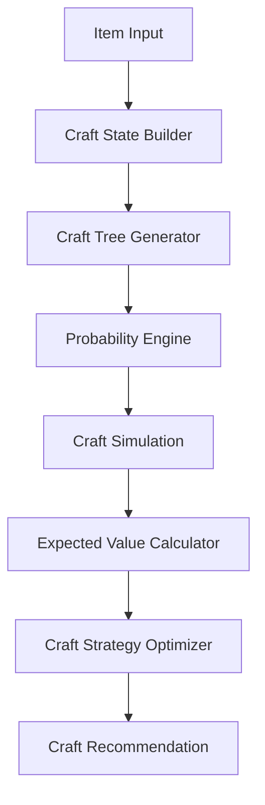
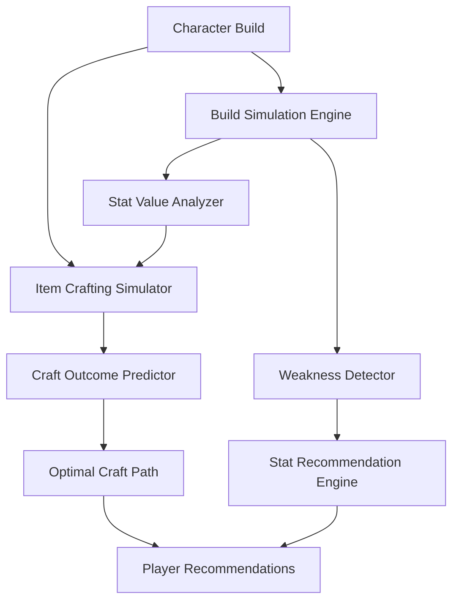

# The Forge – System Architecture

This diagram illustrates how the major systems of **The Forge** interact with each other.

The platform is built around a central **Intelligence Engine** that powers build analysis, crafting prediction, and optimization systems.

---

## High-Level Architecture



---

## Crafting Intelligence System



---

## Full Intelligence Engine Integration



---

# System Overview

The Forge consists of three major analytical layers:

### 1. Build Simulation Engine

Responsible for calculating real build performance.

Metrics include:

* DPS
* Effective Health Pool
* Damage variance
* survivability

---

### 2. Crafting Outcome Predictor

Analyzes crafting actions and calculates:

* success probabilities
* fracture risk
* expected stat outcomes
* optimal crafting paths

---

### 3. Optimization Engine

Determines which upgrades provide the highest value.

Examples:

* best affix upgrades
* most impactful stat increases
* defensive improvement opportunities

---

# Data Flow

The system follows a simulation-driven pipeline:

```
Character Build
      ↓
Stat Engine
      ↓
Combat Simulation
      ↓
Analysis Layer
      ↓
Optimization Engine
      ↓
Crafting Predictor
      ↓
Player Recommendations
```

---

# Design Philosophy

The architecture of The Forge is designed around several key principles:

### Modular Systems

Each system operates independently and communicates through structured data models.

### Simulation-Based Analysis

All recommendations are based on measurable simulation results rather than static formulas.

### Extensibility

The system is designed to support future features such as:

* corruption scaling analysis
* boss encounter simulations
* meta build tracking
* automated loot filter generation

---

# Long-Term Vision

The Forge aims to become a comprehensive analytical toolkit that enables players to:

* analyze builds
* craft intelligently
* optimize gear progression
* explore theorycrafting

By combining simulation and data-driven analysis, The Forge can provide insights that are not available in-game.
